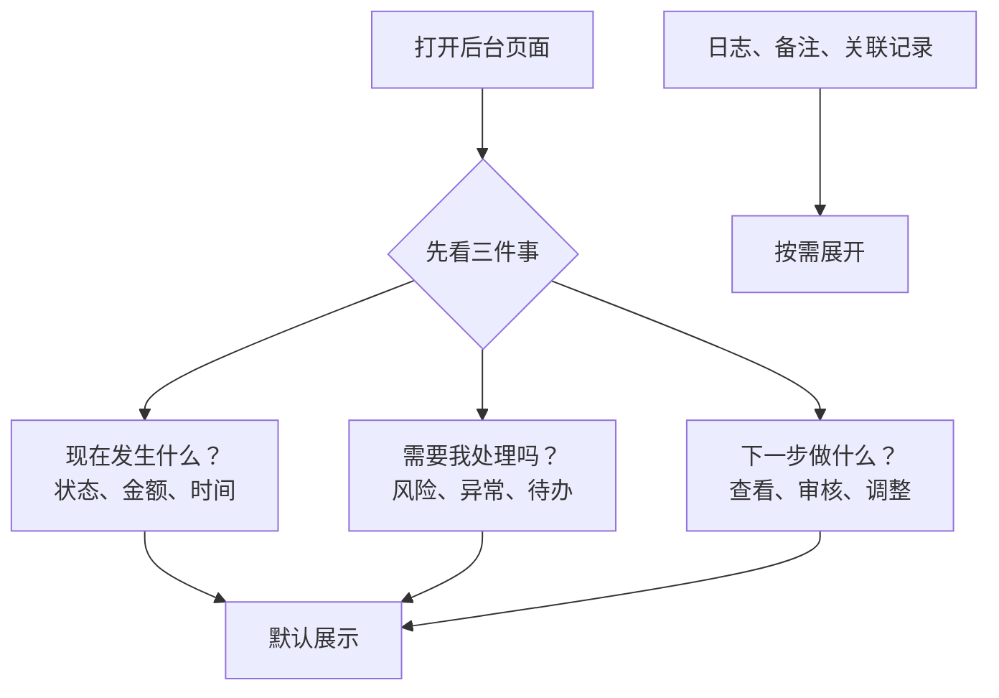
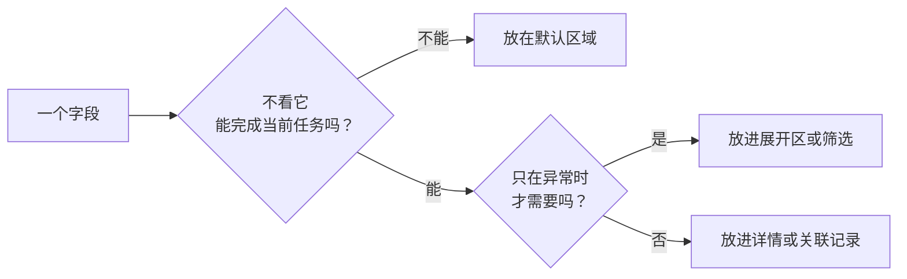

# 复杂后台页面怎样安排信息层级？

复杂后台的难点通常不在“信息不够”，而在于用户打开页面后，无法在几秒内回答三个问题：现在发生了什么、是否需要我处理、下一步应该做什么。

设计时先围绕这三个问题安排信息，再讨论表格密度、颜色和间距，页面会更容易被真实业务使用。

## 先区分默认信息与按需信息

默认展示的是用户每次进入页面都需要判断的内容。对订单或注单类页面，通常包括对象身份、当前状态、金额或风险等级、最近更新时间，以及能够执行的下一步操作。

原始请求、完整日志、历史备注、关联记录等内容同样重要，但并不适合占据首屏。它们可以放入详情、展开区域或筛选条件中，供用户在出现疑问时再查看。

一个实用判断方法是：如果去掉该字段，用户还能否完成当前任务？

- 不能完成：默认展示。
- 只影响少数异常判断：按需展开。
- 只供技术追溯：放入详情或关联记录。

## 列表页的重点随任务变化

同一张订单列表并不只有一种正确排法。

日常查询时，用户更关心对象、状态、金额和时间；风险审核时，风险等级、触发原因和待处理动作应排在更前；批量核对时，应减少低频字段，让多行记录可以快速比较。

因此，列表设计不应只追求“展示更多列”。应先确定用户进入列表的主要任务，再决定默认列和筛选项。字段越多，用户越需要花时间确认哪一列才与当前任务相关。

## 状态反馈必须交代四件事

用户看见“处理中”“失败”或“赔率已变化”时，不能只得到一个标签。好的状态反馈至少包含四部分：

1. **结果**：请求是否已受理、是否完成或是否被拦截。
2. **原因**：是什么规则、网络问题或状态变化导致当前结果。
3. **影响**：金额、订单、权限或当前页面内容是否受影响。
4. **下一步**：用户能重试、修改、查看记录，还是需要等待。

例如，“投注未能提交”不如“当前投注金额超过单笔限额 ¥5,000，可修改金额后重新提交”清楚。后者让用户知道问题所在，也保留了行动路径。

## 危险操作要把影响放在确认前

删除、取消、退款、冲正、解禁和人工调整都会改变数据或资金状态。设计这些操作时，确认弹层应说明对象范围、关键变化和不可恢复的影响，而不是只问一句“确认吗？”。

当操作影响多条记录时，还需要让用户看见数量、筛选条件或记录范围。用户能在提交前确认自己会影响什么，才能避免批量误操作。

## 一句话解释

复杂后台的信息层级，核心是让用户先看见当前状态、处理优先级和下一步动作，再按需查看日志、备注与关联记录。

## 风险与注意事项

- 不要只用颜色表达成功、失败或风险等级，状态文字和处理入口必须同时存在。
- 涉及余额、订单、权限或注单的操作，要在确认前说明对象、影响范围和处理记录要求。
- 列表默认列应围绕当前任务确定，低频字段不要为了“完整”而挤占首屏。
- 移动端要验证加载中、无权限、失败、重复提交和回退路径，不能只检查正常状态。

## 用场景走查代替只看设计稿

页面评审时，建议至少走四种场景：

- 正常完成任务的主路径。
- 没有结果、没有权限或功能不可用的边界状态。
- 网络中断、加载中或重复提交的处理中状态。
- 需要修改、取消或恢复时的回退路径。

最后再分别在桌面和手机尺寸下查看。小屏幕不是把所有字段缩小，而是保留当前判断必需的信息，把低频内容放到可展开区域。

## 小结

复杂页面的清晰感来自明确的优先级：先让用户判断状态和下一步，再提供深入追溯所需的细节。只要列表、详情、反馈和危险操作都能回答“发生了什么、我该做什么”，页面就能从信息堆叠变成真正可处理的工作界面。
