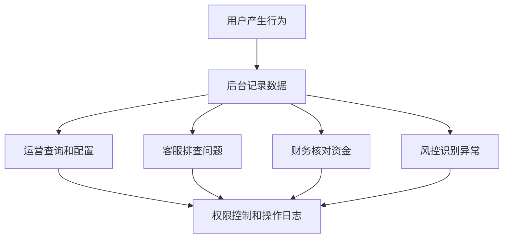

# 博彩后台一般有哪些模块？

## 一句话解释

博彩后台是平台团队管理用户、资金、游戏、活动、代理、报表、权限和异常处理的工作台。

## 适合谁看

- 需要了解后台产品结构的新人
- 准备设计后台模块的产品经理
- 需要使用后台处理日常业务的运营
- 需要理解权限和日志边界的开发

## 核心结论

- 后台不是功能堆叠，而是平台运营和风控的核心工作区。
- 会员、钱包、注单、活动、代理和报表是常见基础模块。
- 权限和操作日志必须从第一版就重视。
- 后台页面要适合高频查询、筛选、审核和导出。
- 任何涉及资金、权限和状态变更的操作都要可追踪。

## 通俗理解

前台是用户使用的平台，后台是团队管理平台的控制台。

运营在后台配置活动，客服在后台查询用户和注单，财务查看资金记录，风控关注异常行为，管理员配置权限。后台的价值不是让页面看起来复杂，而是让关键问题能被快速定位和处理。

## 常见后台模块

- 首页仪表盘
- 会员管理
- 代理管理
- 钱包和资金流水
- 充值与提现
- 游戏厂商管理
- 注单管理
- 活动管理
- VIP 管理
- 报表中心
- 风控规则
- 客服工具
- 权限管理
- 操作日志
- 系统配置

## 后台工作流程

## 模块拆解

| 模块 | 主要用途 | 关键能力 |
|---|---|---|
| 会员管理 | 查询和管理用户 | 状态、标签、限制 |
| 钱包资金 | 查看余额和流水 | 充值、提现、调整 |
| 注单管理 | 排查投注记录 | 状态、结果、派彩 |
| 活动管理 | 配置运营活动 | 规则、审核、发放 |
| 代理管理 | 管理渠道关系 | 下级、佣金、结算 |
| 报表中心 | 看业务数据 | 指标、筛选、导出 |
| 权限日志 | 控制后台操作 | 角色、菜单、记录 |

## 常见误区

### 误区一：后台只给内部用，体验不重要

后台是高频工作工具。如果筛选、表格、状态和操作反馈不好，会直接影响客服、运营和财务效率。

### 误区二：管理员账号可以拥有所有权限

超级权限需要严格控制。日常人员应该按角色授权，敏感操作应有二次确认和日志。

### 误区三：报表有数字就够了

报表需要定义指标口径、时间范围、筛选条件和导出字段，否则不同团队会用不同口径沟通。

## 风险与注意事项

- 涉及资金操作必须有审批和日志
- 后台账号要启用强密码和权限隔离
- 敏感数据展示要做脱敏或限制
- 导出功能要控制权限和范围
- 操作日志要记录操作者、时间、对象和变更前后
- 查询性能要支撑大数据量
- 状态变更要避免误操作和重复提交

## 常见问题

### 第一版后台应该先做哪些模块？

建议先做会员、钱包、注单、充值提现、活动、代理、报表、权限和日志，保证核心业务能运营和排查。

### 后台表格最重要的设计是什么？

筛选条件、状态展示、批量操作、详情抽屉、导出权限和空状态提示都很重要。

### 为什么操作日志这么重要？

因为后台经常涉及资金、权限和用户状态。没有日志，出现争议时很难定位责任和原因。

## 相关术语

- 后台权限
- 会员管理
- 注单
- 钱包
- 活动系统
- 代理系统
- 报表
- 操作日志
