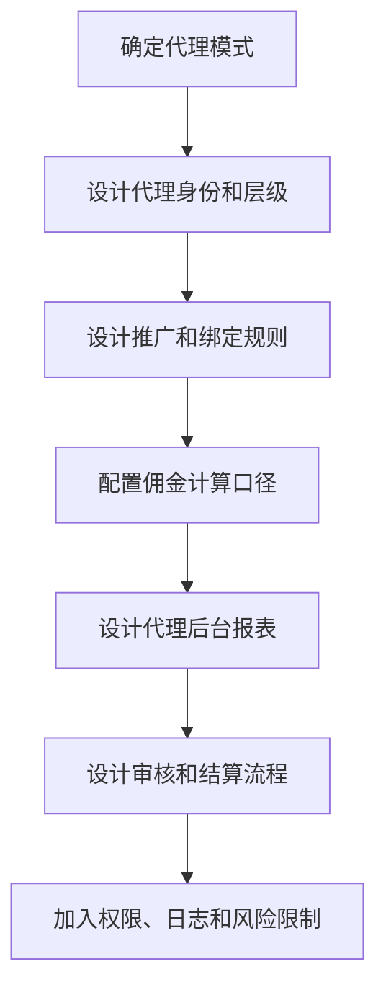

# 代理系统怎么设计？

## 一句话解释

代理系统是帮助平台管理渠道推广、会员归属、佣金计算、下级报表和风险限制的一套后台与前台能力。

## 适合谁看

- 需要写代理系统 PRD 的产品
- 需要配置代理规则和佣金的运营
- 需要理解代理数据口径的项目成员
- 需要排查代理争议和异常推广的客服

## 核心结论

- 代理系统的基础是身份、关系、规则、报表和结算。
- 推广链接只是入口，关键是关系绑定和数据统计。
- 佣金规则必须有清晰口径，避免后续争议。
- 代理后台要展示必要数据，但不能过度暴露用户隐私。
- 风控限制和操作日志是代理体系长期稳定的基础。

## 通俗理解

代理系统可以理解成一个“渠道合作管理系统”。

平台给代理提供推广工具，代理带来会员。系统记录会员来源、统计会员表现，再根据规则生成佣金报表。运营和财务则通过后台审核、调整和结算。

如果没有清楚的规则和报表，代理体系很容易变成争议和异常的集中地。

## 代理系统通常包含什么？

- 代理账号
- 代理等级
- 推广链接和邀请码
- 下级会员列表
- 下级代理列表
- 佣金和返点规则
- 业绩报表
- 结算记录
- 提现或转账申请
- 风控限制
- 后台审核
- 操作日志

## 设计流程

## 核心模块拆解

| 模块 | 主要作用 | 设计重点 |
|---|---|---|
| 代理身份 | 区分代理和会员 | 权限隔离 |
| 层级关系 | 管理上下级 | 层级深度和变更规则 |
| 推广工具 | 追踪来源 | 链接、邀请码、二维码 |
| 佣金规则 | 计算收益 | 口径、周期、审核 |
| 数据报表 | 查看效果 | 注册、首存、活跃、流水 |
| 风控限制 | 降低风险 | 异常注册、关联账号 |

## 常见误区

### 误区一：先做多级代理才显得完整

多级代理会显著增加关系、报表和结算复杂度。早期应先确认业务是否真的需要多层结构。

### 误区二：佣金公式写清楚就够了

还需要定义数据口径、统计周期、扣除项、异常处理、审核状态和结算方式。

### 误区三：代理能看越多数据越好

代理需要看推广效果，但不应看到超出必要范围的用户隐私、资金细节和平台内部风控信息。

## 风险与注意事项

- 代理和会员身份要清晰隔离
- 上下级变更必须有审批和日志
- 佣金报表要能追溯到明细
- 代理后台字段要控制隐私边界
- 批量注册和异常推广要能监控
- 结算前要有冻结、复核或调整机制
- 规则改动要说明影响范围

## 常见问题

### 代理系统最小可用版本需要什么？

代理账号、推广链接、会员绑定、下级列表、基础报表、佣金计算和后台审核。

### 佣金应该实时结算吗？

多数场景更适合周期性统计和审核后结算。实时展示可以作为预估，不一定等同于最终结算。

### 代理后台应该展示哪些指标？

常见包括注册人数、首存人数、活跃人数、有效流水、输赢、佣金、结算状态和下级明细。

## 相关术语

- 代理
- 推广链接
- 邀请码
- 下级管理
- 佣金
- 返点
- 结算周期
- 风控限制
