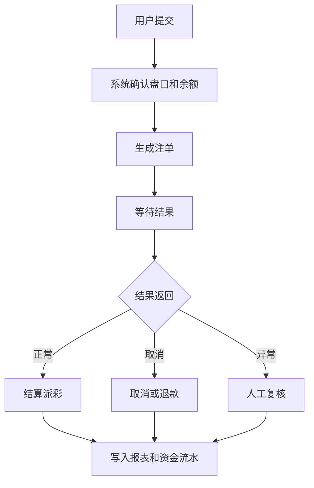

# 注单状态有哪些？

## 一句话解释

注单状态记录的是用户一次投注行为从提交、确认、等待结果到结算或取消的全过程。

## 适合谁看

- 需要设计注单列表和注单详情的产品
- 需要排查用户咨询的客服
- 需要理解结算和派彩流程的开发
- 需要看懂注单报表的运营

## 核心结论

- 注单不是一条静态记录，而是一条有生命周期的业务记录。
- 常见状态包括创建中、已确认、待结算、已结算、已取消、异常。
- 注单状态必须能关联金额、赔率、结果、钱包流水和操作日志。
- 异常注单要保留原因和处理记录。

## 状态流程

## 常见状态说明

| 状态 | 含义 | 排查重点 |
|---|---|---|
| 创建中 | 用户已提交但系统仍在确认 | 盘口、赔率、余额 |
| 已确认 | 注单已生成并锁定 | 金额、赔率、时间 |
| 待结算 | 等待赛事或游戏结果 | 结果来源、状态同步 |
| 已结算 | 已完成输赢和派彩 | 钱包流水、报表 |
| 已取消 | 注单被取消或作废 | 原因、退款记录 |
| 异常 | 状态不完整或结果冲突 | 日志、复核、补偿 |

## 风险与注意事项

- 注单状态要避免重复结算
- 取消和退款要能关联钱包流水
- 厂商返回结果要做幂等处理
- 后台人工处理要有审批和日志
- 报表口径要区分投注、有效投注、输赢和派彩

## 常见问题

### 客服排查注单要看什么？

看注单号、用户、金额、赔率、状态、结果、结算时间、钱包流水和异常日志。

### 注单异常通常来自哪里？

常见来自接口延迟、结果更正、重复回调、余额同步失败或后台人工处理不完整。

## 相关术语

- 注单
- 派彩
- 补单
- 对账
- 风控规则
