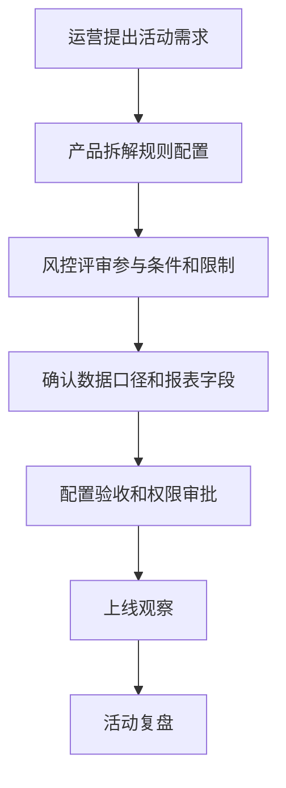

# 活动规则风险评审怎么做？

## 一句话解释

活动规则风险评审是指在活动上线前，把参与条件、奖励规则、数据口径、权限审批、异常处理和复盘指标逐项检查清楚。

## 适合谁看

- 负责活动方案的运营
- 需要写活动系统 PRD 的产品
- 需要评估异常和误用风险的风控
- 需要上线前验收配置的项目成员

## 核心结论

- 活动规则不能只写奖励，还要写条件、限制、数据口径和异常处理。
- 活动配置要和前台展示、后台审核、报表指标保持一致。
- 涉及账户、资金、奖励和权限的操作要保留审批和日志。
- 用户可见规则要清楚，后台执行规则要可验证。
- 活动结束后要复盘效果、争议、异常和配置问题。

## 通俗理解

活动像一套临时业务规则。规则写得越模糊，客服解释、后台配置、数据统计和争议处理就越容易出问题。

风险评审不是为了阻止活动，而是为了让活动上线时规则清楚、边界明确、问题可查。

## 常见流程

## 评审清单

| 项目 | 要检查什么 | 交付物 |
|---|---|---|
| 参与条件 | 用户范围、时间、资格条件 | 活动规则说明 |
| 奖励规则 | 奖励类型、发放方式、限制条件 | 配置表 |
| 数据口径 | 统计字段、周期、排除条件 | 报表口径 |
| 权限审批 | 谁能配置、谁能审核、谁能发放 | 权限记录 |
| 异常处理 | 争议、重复、延迟、失败 | 处理流程 |
| 复盘指标 | 参与、成本、投诉、异常 | 复盘报告 |

## 常见误区

### 误区一：活动文案写清楚就够了

文案只是用户看到的部分。后台配置、报表口径、客服解释和异常处理同样重要。

### 误区二：配置上线后再看问题

活动上线前至少要完成规则评审、配置复核和关键路径测试，否则上线后排查成本会很高。

### 误区三：复盘只看参与数据

复盘还要看投诉、异常处理、客服问题、配置偏差和后续改进项。

## 风险与注意事项

- 不写夸张承诺或压力式文案。
- 用户可见规则与后台执行规则要一致。
- 奖励发放、人工调整和异常处理都要保留日志。
- 敏感配置要有审批，不应由单人独立完成全部流程。
- 活动数据要说明统计周期、来源和排除条件。
- 争议处理要有明确入口、时限和复核记录。

## 常见问题

### 活动评审最容易漏什么？

最容易漏数据口径、异常处理和权限审批。活动能不能顺利落地，往往取决于这些细节。

### 风控应该在什么时候介入？

应在规则定稿前介入，而不是上线前最后一天介入。越早介入，越容易把限制条件和复核流程写进产品方案。

## 相关术语

- 数据报表
- 风控规则
- 后台权限
- 事故复盘
