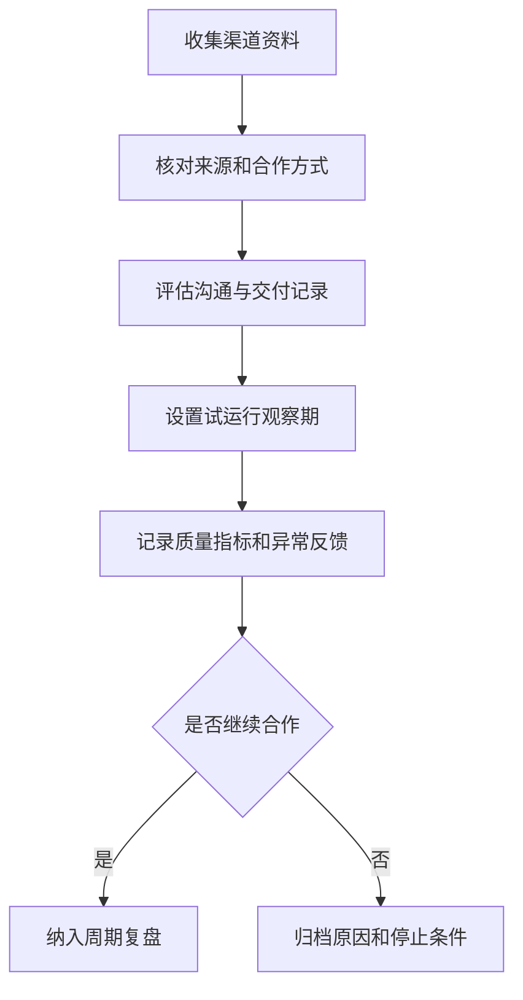

# 渠道质量评估清单怎么做？

## 一句话解释

渠道质量评估清单是用来判断外部合作来源是否稳定、透明、可沟通、可追踪，并且是否符合项目的风险边界。

## 适合谁看

- 需要对接外部渠道的商务
- 需要评估用户来源质量的运营
- 需要管理供应商资料的项目经理
- 需要关注异常反馈和风险边界的负责人

## 核心结论

- 渠道评估不是只看数量，还要看来源说明、沟通记录、异常比例和售后协作。
- 所有合作前都应明确资料、口径、责任边界和停止条件。
- 不清楚来源、不愿留痕、承诺过度的渠道要谨慎。
- 渠道质量应该被持续复盘，而不是只在第一次合作前评估。
- 清单越标准，后续做供应商管理和项目复盘越容易。

## 通俗理解

可以把渠道评估理解成供应商尽调。不是对方说能带来多少结果就可以合作，而是要看信息是否透明、沟通是否稳定、异常是否可处理、合作边界是否清楚。

好的渠道不一定声音最大，但通常资料清楚、反馈及时、接受记录留痕，也愿意配合调整问题。

## 常见流程

## 评估维度

| 维度 | 检查点 | 说明 |
|---|---|---|
| 基础资料 | 主体、联系人、服务范围 | 确认合作对象是谁 |
| 来源说明 | 来源类型、覆盖区域、历史案例 | 评估信息透明度 |
| 沟通记录 | 响应速度、问题处理、资料完整度 | 判断协作稳定性 |
| 风险边界 | 禁止内容、停止条件、争议处理 | 防止责任不清 |
| 复盘指标 | 有效反馈、异常比例、投诉记录 | 判断长期质量 |

## 常见误区

### 误区一：只看短期数量

短期数量不能说明长期质量。如果异常反馈多、资料不完整、投诉集中，后续处理成本可能更高。

### 误区二：口头承诺可以替代记录

合作范围、结算口径、停止条件和争议处理都应该有书面记录，方便对齐和复盘。

### 误区三：渠道评估只做一次

渠道质量会变化。应该按周期复盘质量指标、异常反馈和协作情况。

## 风险与注意事项

- 不接受来源不清、资料缺失或拒绝留痕的合作方式。
- 不把渠道承诺直接写成对用户的公开承诺。
- 不用单一指标判断质量，要结合投诉、异常和处理时长。
- 外部合作账号和后台权限要分开管理。
- 停止合作条件要提前写清楚，避免争议时无法执行。
- 涉及敏感信息时要限制可见范围，并保留访问记录。

## 常见问题

### 渠道质量最应该看什么？

先看资料透明度、沟通稳定性、异常反馈比例和是否接受规则边界。这些比短期表面数据更能说明合作质量。

### 如何处理表现变差的渠道？

先记录变化原因和异常证据，再沟通整改周期。如果持续不符合边界，应按停止条件归档处理。

## 相关术语

- 数据报表
- 后台权限
- 风控规则
- 事故复盘
