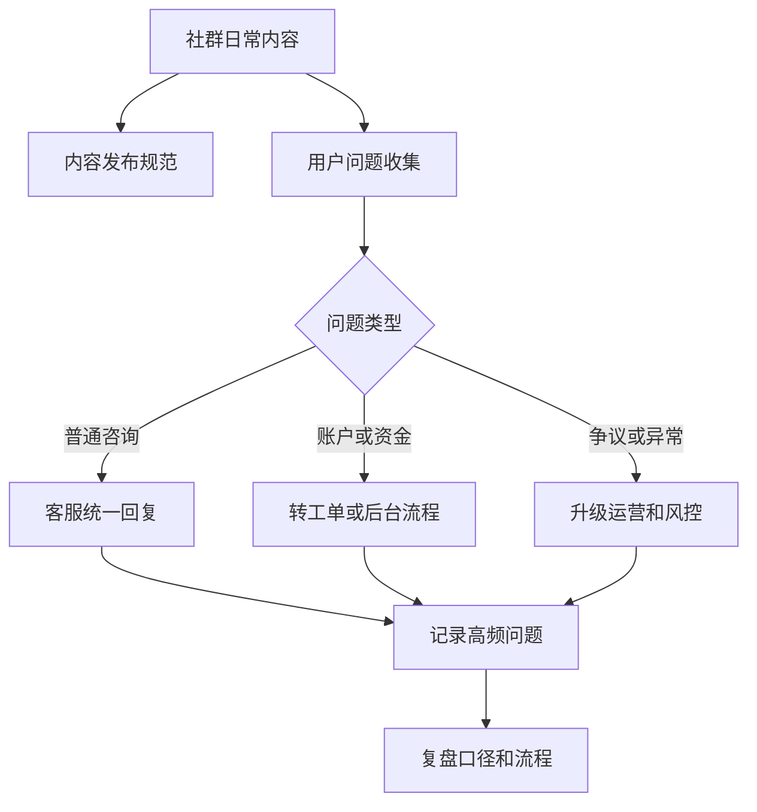

# 社群运营治理 SOP 怎么写？

## 一句话解释

社群运营治理 SOP 是把社群的内容发布、客服协作、风险提醒、权限管理和异常升级流程写清楚，避免社群变成无人负责、口径混乱的沟通场。

## 适合谁看

- 负责社群日常维护的运营
- 需要处理用户问题的客服主管
- 需要定义外部沟通边界的项目经理
- 需要评审内容风险和记录留痕的管理者

## 核心结论

- 社群不是只靠活跃度衡量，还要看内容口径、反馈效率和风险控制。
- SOP 要写清楚谁能发什么、谁能回复什么、哪些问题必须升级。
- 涉及资金、账户、权限和争议的问题要走工单或后台流程，不应只在群里口头处理。
- 社群成员、管理员、客服和风控之间要有分工，避免权限混用。
- 所有异常处理都要能追溯到时间、人员、对象和结论。

## 通俗理解

可以把社群理解成一个对外窗口。窗口可以提高沟通效率，也会放大口径不一致、过度承诺、隐私泄露和争议处理不清的问题。

治理 SOP 的作用不是让社群变得冷冰冰，而是让每个角色知道自己能做什么、不能做什么、遇到异常应该交给谁。

## 常见流程

## 核心模块

| 模块 | 要写什么 | 为什么重要 |
|---|---|---|
| 内容规范 | 发布主题、禁发内容、审核方式 | 避免口径失控 |
| 客服分流 | 普通问题、账户问题、资金问题 | 避免群内处理敏感问题 |
| 风险提醒 | 异常反馈、争议处理、升级条件 | 保护用户和平台 |
| 权限管理 | 管理员、客服、运营权限边界 | 避免权限混用 |
| 记录复盘 | 高频问题、处理时长、升级原因 | 形成可改进资料 |

## 常见误区

### 误区一：社群越活跃越好

活跃度只是表面指标。对平台来说，更重要的是信息是否准确、问题是否被解决、风险是否被及时识别。

### 误区二：管理员可以直接处理所有问题

管理员可以维护秩序和引导流程，但涉及账户、资金、权限和争议的问题应该进入工单、后台或专门复核流程。

### 误区三：社群内容不用归档

高频问题、异常反馈和争议记录都值得归档，否则下一次遇到同类问题只能重新判断。

## 风险与注意事项

- 不在社群公开用户隐私、账户信息和敏感处理细节。
- 不用社群口径替代正式规则、条款、工单和后台记录。
- 不发布夸张承诺、压力式话术或容易引发误解的内容。
- 管理员权限要分级，不要多人共用同一个高权限账号。
- 异常反馈要有截图、时间线和处理结论，方便复盘。
- 社群规则要定期更新，并同步给客服和运营团队。

## 常见问题

### 社群 SOP 最先应该写哪部分？

先写角色分工和升级条件。只要明确普通咨询、账户问题、资金问题和争议问题分别由谁处理，社群秩序会明显稳定。

### 社群治理和客服有什么关系？

社群负责发现问题和统一入口，客服负责标准回复和工单跟进，风控或运营负责异常复核和规则调整。

## 相关术语

- 后台权限
- 风控规则
- 数据报表
- 支付通道
