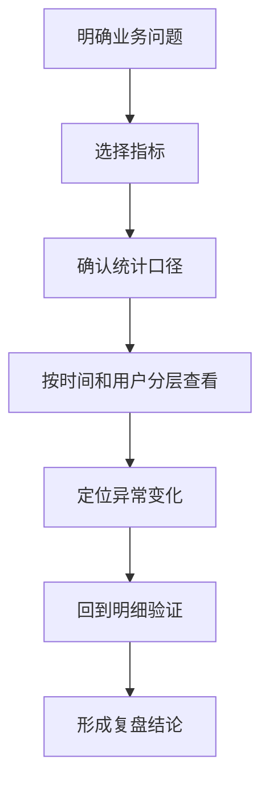

# 数据报表指标怎么看？

## 一句话解释

数据报表是把平台行为转成可分析指标，帮助团队观察转化、活跃、留存、资金和运营效果。

## 适合谁看

- 需要看运营日报的新同事
- 需要设计报表字段的产品
- 需要统一指标口径的管理者
- 需要复盘活动效果的运营

## 核心结论

- 报表最重要的是指标口径一致。
- 注册、首存、复存、流水、注单和派彩分别回答不同问题。
- 单个数字没有意义，必须结合时间、渠道、用户分层和活动背景。
- 报表要能追溯到明细，否则无法排查差异。
- 导出权限和敏感数据展示要受控。

## 报表分析流程

## 常见指标

| 指标 | 说明 | 常见用途 |
|---|---|---|
| 注册人数 | 创建账号的用户数 | 看获客规模 |
| 首存人数 | 第一次充值用户数 | 看转化质量 |
| 复存人数 | 再次充值用户数 | 看留存和信任 |
| 流水 | 投注金额总量 | 看活跃和活动效果 |
| 注单数 | 生成注单数量 | 看使用频率 |
| 派彩 | 结算后发放金额 | 看资金结果 |
| 留存 | 用户持续回来情况 | 看长期价值 |

## 风险与注意事项

- 每个指标要有口径说明
- 报表导出要控制权限
- 财务类指标要能追溯明细
- 时间范围和时区要统一
- 活动数据要区分新增、老客和召回
- 异常波动要能定位到渠道或配置变化

## 常见问题

### 新手看报表先看什么？

先看注册、首存、复存、活跃、流水和留存，再逐步看渠道、活动和用户分层。

### 为什么同一个指标不同页面不一致？

通常是统计口径、时间范围、数据延迟或筛选条件不同，需要先统一定义。

## 相关术语

- 数据报表
- 流水
- 首存
- 复存
- 对账
