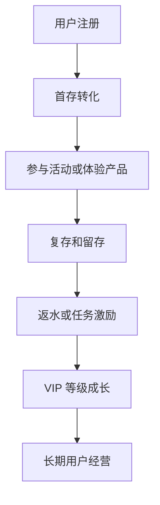

# 首存、复存、返水、VIP 分别是什么？

## 一句话解释

首存、复存、返水和 VIP 是平台常见的用户运营概念，分别对应转化、留存、活跃和长期价值经营。

## 适合谁看

- 刚接触平台运营的新同事
- 需要理解活动系统设计的产品
- 需要看懂运营数据口径的项目成员
- 需要向客户解释活动概念的人

## 核心结论

- 首存关注注册用户是否完成第一次充值。
- 复存关注用户是否愿意持续回来。
- 返水通常按投注流水的一定比例返还奖励。
- VIP 是长期用户分层和权益体系，不是单个活动。
- 所有运营活动都需要规则、审核、数据和风险边界。

## 通俗理解

可以把用户运营理解成一条用户旅程。

注册只是用户进入门口，首存代表用户第一次产生资金行为，复存说明用户愿意继续使用，返水和活动帮助维持活跃，VIP 则用于长期经营高价值用户。

运营不是简单发奖励，而是通过规则和数据观察用户在哪个阶段流失、为什么流失、怎么改善体验。

## 四个概念分别是什么？

- 首存：用户第一次充值
- 复存：用户首存之后再次充值
- 返水：按投注流水比例返还的奖励
- VIP：按贡献度、活跃度或规则划分的等级体系
- 流水：用户投注金额总量，常用于活动和返水计算
- 稽核：提现或活动前对规则完成情况的检查

## 用户运营流程

## 概念对比

| 概念 | 关注阶段 | 常见指标 | 设计重点 |
|---|---|---|---|
| 首存 | 注册后转化 | 首存率、首存金额 | 门槛、奖励、体验 |
| 复存 | 持续使用 | 复存率、复存间隔 | 召回、分层、活动 |
| 返水 | 活跃激励 | 有效流水、返还金额 | 比例、周期、稽核 |
| VIP | 长期经营 | 等级人数、晋级率 | 权益、保级、生命周期 |

## 常见误区

### 误区一：首存就是注册

注册只是创建账号，首存是第一次充值。两者对应的转化环节完全不同。

### 误区二：返水等于盈利返还

返水通常基于投注流水计算，不等于用户输赢，也不等于平台利润返还。

### 误区三：VIP 只是给高价值用户发礼金

VIP 更像长期经营体系，需要等级规则、晋级、保级、权益、触达和数据复盘。

## 风险与注意事项

- 活动规则要清楚说明适用用户和参与条件
- 奖励发放要有审核或自动校验
- 流水要求和提现限制要透明
- 防止同一用户重复领取异常奖励
- 不要用夸张收益承诺刺激用户
- 活动数据要能区分新增、留存和复活
- VIP 权益要能长期承担，避免承诺过重

## 常见问题

### 首存活动最重要看什么？

看注册到首存的转化率、首存成本、活动后留存和异常领取比例，而不是只看短期充值金额。

### 复存低通常说明什么？

可能是支付体验差、产品体验弱、活动吸引力不足、用户分层不准确或召回节奏不合理。

### VIP 体系应该从什么时候开始做？

当平台已经有稳定用户和基础数据后再做更合适。太早做复杂 VIP，可能难以验证效果。

## 相关术语

- 首存
- 复存
- 返水
- VIP
- 流水
- 活动系统
- 用户分层
- 稽核规则
