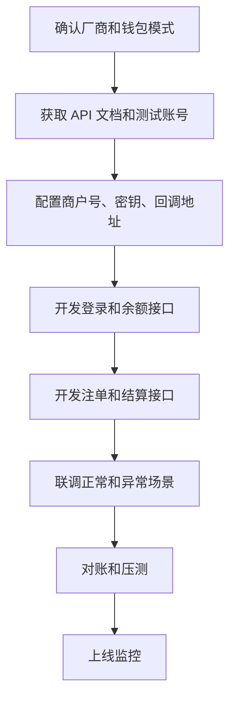

# 游戏厂商 API 如何对接？

## 一句话解释

游戏厂商 API 对接，就是让平台系统和外部游戏厂商通过接口完成登录、余额、投注记录、结算和异常处理。

## 适合谁看

- 需要理解厂商对接流程的产品和项目经理
- 刚开始接触游戏接口的开发
- 需要协调平台、厂商和测试的实施人员
- 需要排查游戏余额或注单问题的运营

## 核心结论

- 厂商对接不是只拿一个游戏链接，而是一组接口和状态协作。
- 常见接口包括登录、余额查询、扣款、派彩、注单拉取和回调。
- 对接前要确认钱包模式、币种、语言、环境和签名规则。
- 对接后要重点测试登录、余额、注单、结算、取消和异常补偿。
- 接口日志、重试机制和对账能力决定后期排查效率。

## 通俗理解

可以把平台和游戏厂商理解成两个系统之间的合作。

用户点击游戏时，平台告诉厂商“这个用户是谁、可以进入哪个游戏”。用户在游戏中产生记录后，厂商再把下注、输赢、结算等结果告诉平台。平台根据这些结果更新余额和报表。

如果接口状态不清楚，就容易出现用户进不去游戏、余额不一致或注单查不到的问题。

## 对接通常包含什么？

- 厂商账号和商户号
- API 文档
- 测试环境
- 签名和加密规则
- 游戏列表接口
- 游戏登录接口
- 余额查询接口
- 扣款和派彩接口
- 注单拉取或回调
- 取消和回滚接口
- 对账文件或报表
- 错误码说明
- 上线验收清单

## 对接流程

## 常见接口说明

| 接口 | 作用 | 关注点 |
|---|---|---|
| 游戏列表 | 获取可展示游戏 | 分类、状态、图标 |
| 游戏登录 | 生成进入游戏地址 | 用户身份、语言、币种 |
| 余额查询 | 查询用户余额 | 钱包模式、缓存 |
| 下注扣款 | 游戏行为扣减余额 | 幂等、失败处理 |
| 派彩结算 | 返回结果并入账 | 注单状态、重复回调 |
| 注单拉取 | 同步记录 | 时间范围、分页 |
| 对账 | 核对差异 | 日切、时区、口径 |

## 常见误区

### 误区一：厂商给了链接就能上线

上线前还要完成账号、签名、余额、注单、结算、异常和对账测试。

### 误区二：接口成功就代表业务成功

接口返回成功只是技术状态。业务上还要确认余额是否正确、注单是否生成、报表是否统计。

### 误区三：异常后人工改余额就行

人工调整只能作为补救，必须保留日志，并尽量通过接口重试、补单和对账找到根因。

## 风险与注意事项

- 签名密钥要安全保存
- 接口请求和响应要记录日志
- 重复回调要做幂等处理
- 余额变化要能关联到注单或接口记录
- 厂商维护和超时要有前台提示
- 对账要处理时区和统计口径差异
- 上线后要监控错误码、延迟和失败率

## 常见问题

### 产品需要看懂 API 文档吗？

不需要写代码，但要能理解接口对应的业务场景、状态、错误码和测试用例。

### 对接最容易出问题的是哪里？

常见问题在签名、币种、时区、余额一致性、重复回调、注单状态和对账口径。

### 为什么要做对账？

因为平台和厂商是两个系统。即使接口大部分时间正常，也需要定期核对注单和资金差异。

## 相关术语

- API
- 游戏厂商
- 商户号
- 签名
- 回调
- 注单
- 派彩
- 对账
