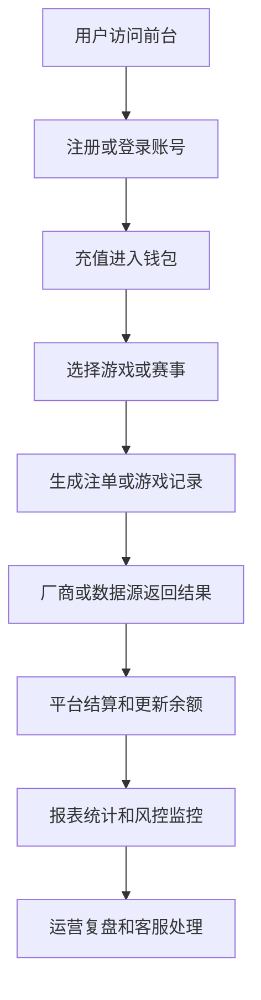

# 博彩平台是怎么运转的？

## 一句话解释

博彩平台可以理解成一个连接用户、游戏内容、资金系统、运营活动和后台管理的综合业务系统。

## 适合谁看

- 刚进入行业，想先建立整体认知的人
- 需要理解平台模块关系的产品和运营
- 需要和技术、客服、风控沟通的项目成员
- 想把前台页面和后台系统联系起来理解的人

## 核心结论

- 平台不是只有一个前台，它背后是一整套业务系统。
- 用户看到的是注册、充值、游戏、活动和提现，后台关注的是资金、注单、权限、报表和风险。
- 游戏厂商、支付通道和平台系统之间通常通过接口协同。
- 运营活动能提升转化和留存，但必须配合规则、审核和异常监控。
- 平台长期稳定依赖清晰权限、完整日志、准确报表和可追踪的资金流水。

## 通俗理解

可以把博彩平台理解成一个“线上综合服务大厅”。

用户进入大厅后，会注册账号、查看活动、充值余额、进入不同游戏或体育赛事页面。平台后台则像管理办公室，需要处理用户资料、资金记录、注单状态、活动发放、代理推广和异常排查。

真正复杂的地方不在页面是否好看，而在每个环节是否能被准确记录、正确结算、及时监控。

## 平台通常包含什么？

一个基础平台通常包含：

- 前台网站或 App
- 会员系统
- 登录与账号安全
- 充值与提现
- 钱包与资金流水
- 游戏厂商或体育数据接入
- 注单与结算系统
- 活动系统
- 代理系统
- 后台管理
- 数据报表
- 权限与操作日志
- 风控和异常监控

## 平台运转流程

## 前台和后台分别负责什么？

| 模块 | 前台用户看到的内容 | 后台团队关注的内容 |
|---|---|---|
| 会员 | 注册、登录、资料 | 用户状态、标签、限制 |
| 钱包 | 余额、充值、提现 | 资金流水、稽核、异常 |
| 游戏 | 游戏入口、玩法列表 | 厂商状态、注单、结算 |
| 活动 | 首存、返水、VIP | 规则配置、审核、数据 |
| 代理 | 邀请、推广链接 | 下级关系、佣金报表 |
| 报表 | 通常不可见 | 运营指标、财务指标 |

## 常见误区

### 误区一：平台就是一个网站页面

前台页面只是入口。真正决定平台是否可运营的是账号、钱包、注单、报表、权限和异常处理能力。

### 误区二：接入游戏后就算完成平台

游戏内容只是其中一环。平台还需要资金链路、客服处理、活动规则、风控监控和运维保障。

### 误区三：后台功能越多越好

功能多不一定代表好。更重要的是模块边界清楚、数据准确、权限可控、关键链路可追踪。

## 风险与注意事项

- 资金流水必须能追踪来源、去向和状态
- 注单状态需要和厂商返回结果保持一致
- 后台权限要避免过度开放
- 活动规则要有清晰限制和审核逻辑
- 支付、游戏和登录链路都需要监控
- 客服和运营要能快速定位用户问题
- 异常处理需要保留日志和复盘记录

## 常见问题

### 新人应该先理解哪些模块？

建议先理解会员、钱包、游戏、注单、活动、代理和后台权限。这几个模块能串起大部分业务场景。

### 产品和运营关注点有什么不同？

产品更关注流程、规则、权限和系统边界；运营更关注转化、留存、活动效果和用户分层。两者需要使用同一套数据语言沟通。

### 技术团队最怕什么问题？

最怕链路状态不清、接口没有日志、资金变化无法追踪、异常没有告警。这些问题会放大排查成本。

## 相关术语

- 会员
- 代理
- 钱包
- 注单
- 派彩
- 活动系统
- 后台权限
- 数据报表
