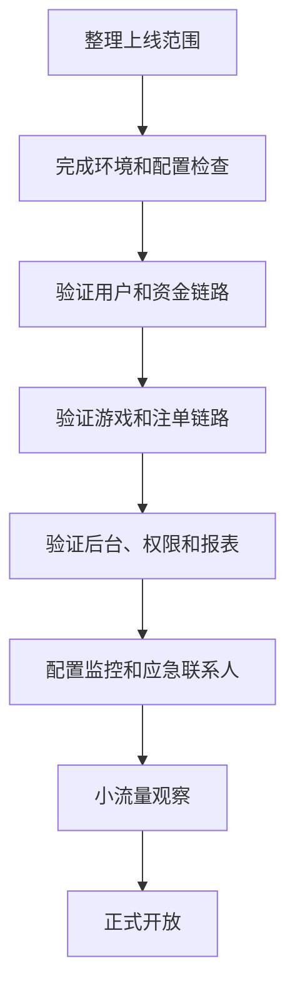

# 博彩平台上线前检查清单

## 一句话解释

上线前检查清单是帮助团队确认注册、资金、游戏、注单、活动、权限、监控和应急流程都准备好的工作资料。

## 适合谁看

- 准备推进平台上线的项目经理
- 负责验收核心链路的产品和测试
- 负责监控、告警和发布的运维
- 需要协调客服、运营、技术和供应商的负责人

## 核心结论

- 上线不是页面能打开就结束，而是核心业务链路都要可用。
- 注册、登录、充值、提现、游戏进入、注单、结算和报表必须重点验证。
- 后台权限、操作日志、监控告警和应急联系人要提前准备。
- 活动、代理和支付配置要用真实业务场景测试。
- 上线后要有观察期，持续监控错误率、支付成功率和用户反馈。

## 通俗理解

上线前检查就像飞机起飞前的检查表。

每一项看起来都普通，但遗漏任何关键环节，都可能在正式运营后变成用户投诉、资金差异或后台无法处理的问题。清单的价值不是形式，而是让团队在上线前共同确认“哪些已经准备好，哪些还有风险”。

## 检查范围

- 域名和证书
- 前台页面
- 注册和登录
- 充值和提现
- 钱包和资金流水
- 游戏进入
- 注单生成
- 结算和派彩
- 活动配置
- 代理绑定
- 后台权限
- 报表统计
- 风控规则
- 监控告警
- 客服和应急流程

## 上线流程

## 核心检查项

| 模块 | 检查内容 | 通过标准 |
|---|---|---|
| 账号 | 注册、登录、找回 | 正常创建和访问 |
| 资金 | 充值、提现、流水 | 金额准确、状态清楚 |
| 游戏 | 进入、退出、余额 | 可访问、余额同步 |
| 注单 | 生成、结算、取消 | 状态完整可追踪 |
| 活动 | 领取、审核、发放 | 规则生效、日志完整 |
| 后台 | 权限、查询、导出 | 角色隔离、操作可查 |
| 运维 | 告警、日志、回滚 | 有负责人和预案 |

## 常见误区

### 误区一：测试环境通过就可以直接上线

测试环境和生产环境可能在域名、支付、厂商、配置、权限和数据量上不同，必须做生产前验证。

### 误区二：只测正常流程就够了

还要测试失败、取消、超时、重复提交、接口异常和权限不足等情况。

### 误区三：上线后再补监控

监控和告警应该在上线前准备，否则正式流量进来后，团队很难及时发现问题。

## 风险与注意事项

- 生产密钥和回调地址要核对
- 支付和厂商状态要提前确认
- 资金相关操作要有日志和审批
- 后台账号不要共用
- 活动规则要避免误发或重复发放
- 上线窗口要安排技术、产品、运营、客服待命
- 回滚方案和紧急联系人要明确

## 常见问题

### 上线前最应该优先测什么？

优先测用户注册登录、充值提现、游戏进入、注单生成、结算派彩、后台查询和操作日志。

### 是否需要小流量灰度？

如果条件允许，建议先小范围开放观察。这样能更早发现支付、厂商、性能和客服流程问题。

### 上线后观察哪些指标？

关注访问错误率、登录成功率、充值成功率、提现处理时长、游戏进入成功率、注单异常率和接口告警。

## 相关术语

- 上线检查
- 回滚方案
- 监控告警
- 操作日志
- 资金流水
- 注单结算
- 后台权限
- 事故复盘
