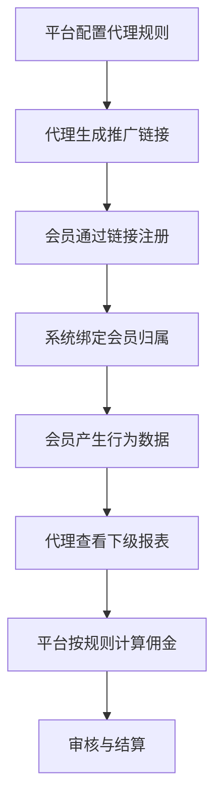

# 会员、代理、平台三者是什么关系？

## 一句话解释

平台提供系统和规则，代理负责推广和维护下级用户，会员是实际使用平台服务的人。

## 适合谁看

- 想理解代理体系基础关系的行业新人
- 需要设计代理后台的产品
- 需要配置推广、佣金和报表的运营
- 需要排查会员归属关系的客服或项目成员

## 核心结论

- 会员、代理、平台是三种不同角色，不应混在一起理解。
- 代理更像渠道合作方，通常通过推广链接或邀请码发展会员。
- 平台需要记录会员归属、代理层级、佣金规则和结算周期。
- 代理体系越复杂，权限、报表和风险边界越重要。
- 好的代理系统不是只算佣金，还要能管理关系、限制风险和支持复盘。

## 通俗理解

可以把平台理解为商场，代理理解为渠道推广方，会员理解为到店消费的用户。

代理把用户带到平台，平台根据事先配置的规则统计用户表现，再给代理展示下级数据、佣金报表和推广效果。但平台也需要确保关系绑定清楚、规则透明、数据可追踪。

## 三者分别负责什么？

- 平台：提供前台、后台、钱包、游戏、活动、报表和规则
- 代理：推广用户、维护下级、查看数据和收益
- 会员：注册账号、参与活动、使用平台功能
- 后台运营：配置代理等级、返点规则、审核和异常限制
- 风控团队：关注异常注册、关联账号、异常推广和资金风险

## 角色关系流程

## 常见关系字段

| 字段 | 用途 | 注意点 |
|---|---|---|
| 代理账号 | 标识代理身份 | 和会员账号权限分开 |
| 推广链接 | 追踪来源 | 需要防止混淆和失效 |
| 邀请码 | 注册绑定 | 要有唯一性和有效期 |
| 上级代理 | 形成层级 | 层级过深会增加复杂度 |
| 下级会员 | 归属统计 | 绑定规则要明确 |
| 佣金报表 | 收益计算 | 口径必须清楚 |

## 常见误区

### 误区一：代理就是普通会员

代理可以同时是用户，但在系统设计上，代理角色需要额外的推广、下级、报表和结算能力。

### 误区二：只要有推广链接就算代理系统

推广链接只是入口。完整代理系统还需要关系绑定、层级管理、佣金规则、报表、审核和权限。

### 误区三：层级越多越强大

层级越多，结算和风控越复杂。早期系统应优先保证规则清楚、数据准确和排查方便。

## 风险与注意事项

- 会员归属规则必须提前定义
- 修改上级关系要保留操作日志
- 佣金计算口径要和报表一致
- 代理后台不能暴露不该看的用户隐私
- 异常推广和批量注册要能识别
- 结算前应有审核和冻结机制
- 代理权限要和普通会员权限隔离

## 常见问题

### 会员可以换代理吗？

可以由平台规则决定，但必须有审批、记录和影响说明，否则容易造成佣金争议。

### 代理一定有多级吗？

不一定。一级代理更简单，适合早期启动；多级代理适合更复杂渠道，但系统和管理成本更高。

### 代理系统的核心报表是什么？

常见包括注册人数、首存人数、活跃会员、有效流水、输赢、佣金、下级明细和结算状态。

## 相关术语

- 代理
- 会员
- 推广链接
- 邀请码
- 下级会员
- 佣金
- 返点
- 代理后台
