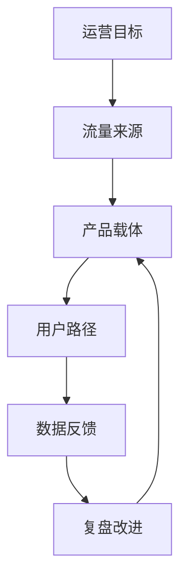

# 运营和产品为什么要放在一起看？

## 一句话解释

运营负责带来流量和提出目标，产品负责把目标变成可理解、可操作、可记录、可复盘的载体。

## 适合谁看

- 需要理解运营目标的产品和设计
- 需要把想法讲清楚的运营同事
- 需要判断项目方向的老板和项目负责人
- 刚接触包网平台的新同事

## 核心结论

- 产品开发如果只看功能，很容易停留在“把东西做出来”。
- 理解运营为什么这样做，产品才能更贴近真实目标。
- 运营提供流量，产品提供载体，数据负责验证路径是否有效。
- 载体可以是应用、商品、工具、内容、活动页、后台看板或客服入口。
- 好的产品不是堆功能，而是让用户路径、业务规则和团队协作更清楚。

## 通俗理解

可以把“运营 + 产品”理解成一套承接模型。

运营像水流，产品像管道和容器。水从哪里来、质量如何、流到哪里、有没有漏、最后能不能被复盘，都需要设计清楚。

如果只看功能，团队容易讨论按钮、页面和字段；如果先看运营目标，团队会先问：这个功能要承接什么用户需求？要减少什么沟通成本？要让哪个角色更快判断？要留下哪些数据？

## 核心模型

## 四个关键问题

| 层级 | 要回答的问题 | 产品上通常体现为 |
|---|---|---|
| 流量 | 用户从哪里来，质量如何 | 渠道标记、来源记录、入口区分 |
| 载体 | 用什么承接用户需求 | 官网、H5、App、活动页、客服入口、后台工具 |
| 转化 | 用户是否完成目标动作 | 表单、状态、提示、审核、服务分流 |
| 复盘 | 哪些路径有效，哪里有问题 | 报表、明细、日志、异常记录、复盘模板 |

这里的转化不是单指某个商业动作，而是用户是否完成了当前阶段的目标。例如看懂规则、完成认证、找到客服、理解状态、提交资料、完成一次关键操作，都是产品需要承接的目标。

## 产品应该怎么理解运营需求？

### 先问目标，而不是先画页面

运营提出需求时，产品不要只问“要几个按钮、几个字段”，而要先问：

- 这个需求对应哪个用户阶段？
- 是为了解决理解问题、路径问题、服务问题，还是数据问题？
- 哪些角色会参与处理？
- 哪些状态必须能查？
- 后续怎么判断做得好不好？

### 再拆载体，而不是只拆功能

同一个运营目标，可能需要多个载体共同承接。

例如一个活动，不只是前台活动页，还会涉及后台配置、客服话术、数据报表、异常审核、复盘记录。产品要把这些载体串起来，而不是只完成一个展示页面。

### 最后看复盘，而不是上线即结束

运营需求上线后，真正有价值的是复盘。产品需要让数据、日志、状态、客服反馈和异常处理都能回到同一个判断框架里。

如果一个功能上线后没人能解释效果，也查不到问题，说明它只是“做出来”，还没有形成可运营的产品能力。

## 常见误区

### 误区一：运营需求就是做活动页面

活动页面只是载体之一。完整需求通常还包括规则配置、状态展示、审核记录、数据口径、客服解释和异常处理。

### 误区二：产品只负责实现功能

产品不只是实现功能，还要帮助团队把目标、路径、状态、数据和角色分工讲清楚。

### 误区三：数据报表只是给运营看的

数据报表也是产品复盘工具。它能帮助产品判断页面、流程、状态提示和后台操作是否需要调整。

## 风险与注意事项

- 不把运营目标写成夸张承诺。
- 不把活动和权益设计成无法解释、无法复核的规则。
- 不把渠道数量当成唯一判断，要看来源质量和协作记录。
- 不把客服和后台留到最后补，很多运营问题都需要它们承接。
- 不把上线当结束，至少要保留数据口径、异常记录和复盘结论。

## 常见问题

### 这个模型只适合包网平台吗？

不是。只要一个业务有流量、有承接载体、有目标动作、有数据反馈，就可以用这个模型理解。应用、商品、工具、内容、课程、咨询和企业软件都能套用。

### 产品新人应该先学什么？

先学用户路径和业务状态。知道用户从哪里来、要做什么、卡在哪里、谁来处理，比先学复杂页面更重要。

### 运营和产品最容易在哪些地方沟通错位？

最容易错位在目标和指标。运营说的是业务目标，产品听成了页面功能；运营看结果，产品看交付。两边需要用路径、状态和数据口径把问题对齐。

## 相关术语

- 运营治理
- 数据报表
- 渠道质量
- 活动系统
- 客服协作
- 后台权限
- 异常复盘
