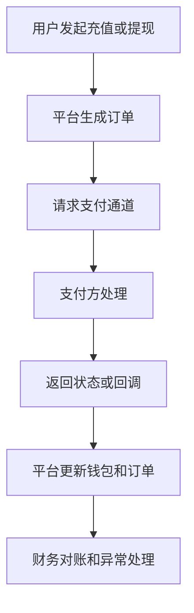

# 支付通道是什么？

## 一句话解释

支付通道是平台连接外部支付服务，用来处理充值、提现、订单状态回调和财务对账的接口链路。

## 适合谁看

- 需要理解充值和提现流程的运营
- 需要设计支付页面和后台的产品
- 需要协调支付方、技术和财务的项目经理
- 需要排查订单状态异常的客服和运维

## 核心结论

- 支付通道不是一个按钮，而是一条包含订单、状态、回调、限额和对账的链路。
- 充值关注订单创建、付款、回调和入账。
- 提现关注审核、出款、失败退回和操作记录。
- 对账能发现平台、支付方和财务记录之间的差异。
- 支付相关操作必须保留日志、权限和异常处理流程。

## 通俗理解

可以把支付通道理解成平台和外部支付服务之间的“收银和出纳接口”。

用户在前台发起充值，平台生成订单，支付方处理付款，然后通过回调告诉平台是否成功。提现则通常要经过后台审核、风控检查、出款处理和状态同步。

## 基础流程

## 常见模块

| 模块 | 作用 | 关注点 |
|---|---|---|
| 支付订单 | 记录每次充值或提现 | 金额、状态、时间 |
| 回调处理 | 同步支付方结果 | 幂等、验签、重试 |
| 后台审核 | 管理提现和异常 | 权限、日志、风控 |
| 对账报表 | 核对订单差异 | 口径、明细、导出 |

## 常见误区

### 误区一：支付成功就是余额一定成功入账

支付成功后还需要平台正确收到回调、校验订单、更新钱包和记录资金流水。

### 误区二：提现只是用户点一个按钮

提现通常涉及余额校验、活动稽核、风险识别、后台审核、出款状态和失败退回。

### 误区三：对账只看总金额

对账还要看订单明细、状态、时间、手续费和差异原因。

## 风险与注意事项

- 回调接口要验签并防止重复处理
- 订单状态变化要有日志
- 提现审核要有权限隔离
- 失败订单要有明确状态和原因
- 财务对账要能导出明细
- 支付限额、费率和通道状态要可配置

## 常见问题

### 为什么用户付款了但平台没入账？

可能是回调延迟、验签失败、订单状态未更新、钱包入账失败或支付方状态异常，需要从订单、回调和资金流水一起排查。

### 支付通道最重要的后台能力是什么？

订单查询、状态筛选、回调日志、人工补单、对账导出和敏感操作日志。

## 相关术语

- 支付通道
- 对账
- 补单
- 资金流水
- 后台权限
