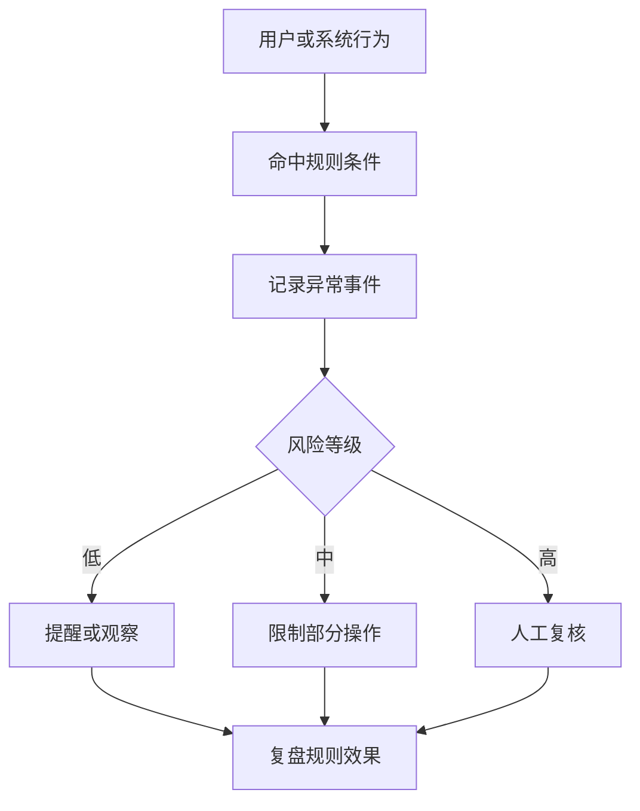

# 风控规则基础怎么理解？

## 一句话解释

风控规则是平台用来识别异常行为、触发提醒、限制操作和进入人工复核的一组业务条件。

## 适合谁看

- 需要理解风控边界的产品和运营
- 需要设计异常监控的项目成员
- 需要配置后台限制策略的风控人员
- 需要避免误伤正常用户的团队负责人

## 核心结论

- 风控规则的目标是识别风险、保留证据和规范处理，不是教人规避规则。
- 规则要包含触发条件、处理动作、复核流程和解除条件。
- 过严会误伤正常用户，过松会增加平台风险。
- 所有敏感处理都要有权限、审批和操作日志。
- 规则效果需要定期复盘。

## 基础流程

## 规则结构

| 组成 | 示例 | 注意点 |
|---|---|---|
| 触发条件 | 频率、金额、设备、行为 | 口径清楚 |
| 风险等级 | 低、中、高 | 动作不同 |
| 处理动作 | 提醒、限制、复核 | 避免过度处理 |
| 日志记录 | 时间、对象、原因 | 可追踪 |
| 解除条件 | 自动解除或人工解除 | 避免永久误伤 |

## 风险与注意事项

- 不公开敏感规则细节
- 不提供规避规则的方法
- 规则命中要保留证据
- 人工处理要有审批和日志
- 解除限制要有清晰条件
- 报表要记录命中量、误伤率和处理结果

## 常见问题

### 产品写风控需求要写什么？

写清楚场景、条件、等级、动作、提示、后台记录、权限和复核流程。

### 风控规则怎么评估效果？

看命中数量、确认异常比例、误伤反馈、人工处理时长和复盘结论。

## 相关术语

- 风控规则
- 后台权限
- 操作日志
- 异常监控
