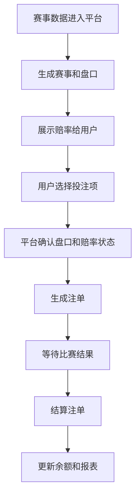

# 体育博彩平台是怎么运转的？

## 一句话解释

体育博彩平台围绕赛事数据、盘口赔率、用户注单、赛果结算和风险控制运转。

## 适合谁看

- 想理解体育博彩基础链路的新人
- 需要设计赛事列表、投注单和注单页的产品
- 需要看懂盘口、赔率和结算状态的运营
- 需要和体育数据或风控团队沟通的人

## 核心结论

- 体育博彩的核心对象是赛事、市场、盘口、赔率和注单。
- 早盘发生在比赛前，滚球发生在比赛进行中。
- 赔率会随赛事信息、市场变化和风控策略调整。
- 注单从提交到结算会经历确认、锁定、等待结果、派彩或取消等状态。
- 体育产品对数据延迟、状态准确性和异常处理要求较高。

## 通俗理解

可以把体育博彩页面理解成一个“实时赛事交易看板”。

用户看到的是比赛、盘口和赔率，系统背后需要持续接收赛事时间、比分、红黄牌、暂停、取消、赛果等信息。每次用户提交选择，平台都要确认盘口是否仍然开放、赔率是否有效、金额是否符合限制，然后生成注单。

体育产品的难点不是单个页面，而是“时间变化”带来的状态管理。

## 体育平台通常包含什么？

- 赛事列表
- 联赛和队伍数据
- 早盘和滚球
- 盘口与赔率展示
- 投注单
- 注单记录
- 赛果确认
- 结算与派彩
- 限额与风控
- 异常注单处理
- 体育后台配置

## 基础业务流程

## 关键概念对比

| 概念 | 含义 | 典型关注点 |
|---|---|---|
| 赛事 | 一场比赛或活动 | 时间、队伍、状态 |
| 盘口 | 投注条件 | 让球、大小、胜平负 |
| 赔率 | 回报计算参数 | 展示格式、变动、确认 |
| 注单 | 用户提交的投注记录 | 金额、赔率、状态 |
| 赛果 | 结算依据 | 数据来源、确认流程 |
| 风控 | 风险管理规则 | 限额、异常、延迟 |

## 常见误区

### 误区一：赔率只是一个固定数字

赔率会随赛事信息、市场变化、平台策略和风险情况调整。用户提交时看到的赔率，也需要经过系统确认。

### 误区二：滚球只是比赛中的早盘

滚球变化更快，对数据延迟、盘口关闭、赔率刷新和注单确认有更高要求。

### 误区三：注单生成就一定能正常结算

注单还会受到赛事取消、结果更正、盘口暂停、数据延迟等因素影响，需要后台有清晰状态和处理记录。

## 风险与注意事项

- 赛事状态变化要及时同步
- 盘口关闭和赔率变化要有明确提示
- 注单确认过程要避免状态不一致
- 赛果来源和更正流程要可追踪
- 高风险赛事和异常投注需要监控
- 客服需要看到注单完整状态链路
- 报表要区分投注额、有效投注和派彩结果

## 常见问题

### 早盘和滚球最大的区别是什么？

早盘发生在比赛开始前，状态变化相对慢；滚球发生在比赛中，赔率和盘口会随比赛进程频繁变化。

### 为什么提交注单时会提示赔率变化？

因为用户选择后，系统在最终确认前发现赔率已经更新。产品上通常需要让用户确认是否接受新赔率。

### 体育平台最重要的后台能力是什么？

至少要能查看赛事、盘口、注单、结算、限额、异常和操作日志，否则排查问题会非常困难。

## 相关术语

- 早盘
- 滚球
- 串关
- 盘口
- 水位
- 注单
- 派彩
- 风控
