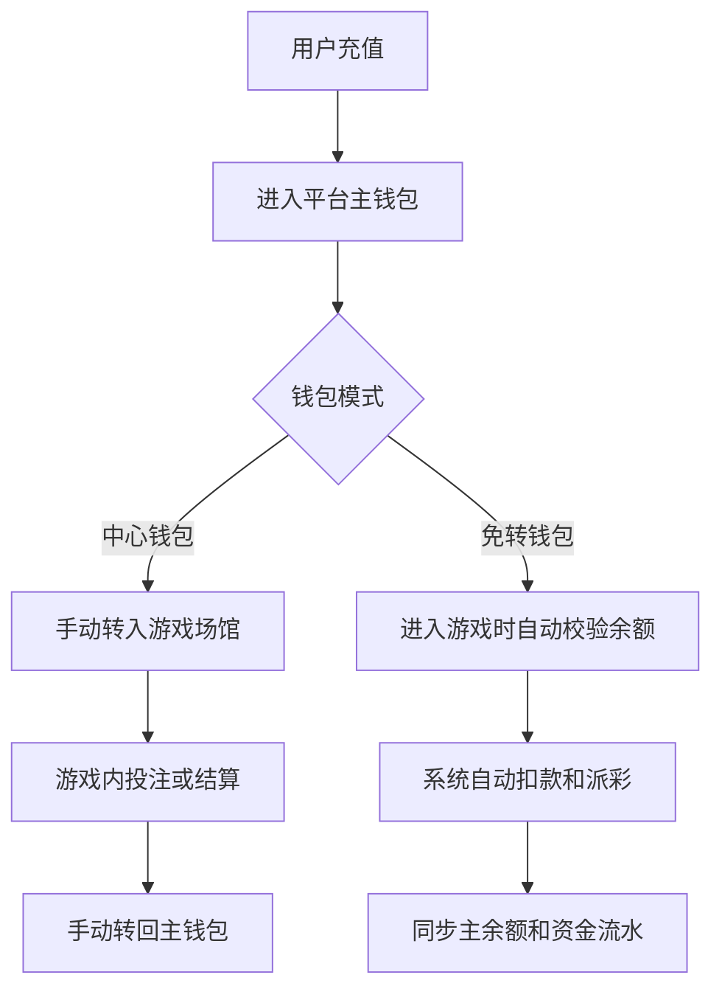

# 中心钱包和免转钱包有什么区别？

## 一句话解释

中心钱包需要用户在平台主余额和游戏场馆之间转入转出，免转钱包则尽量让用户直接使用同一个余额进入不同游戏。

## 适合谁看

- 需要理解钱包产品形态的产品经理
- 需要和游戏厂商对接余额接口的技术人员
- 需要解释用户余额异常的客服和运营
- 正在评估平台体验和接口稳定性的项目成员

## 核心结论

- 中心钱包逻辑更直观，但用户操作步骤更多。
- 免转钱包体验更顺滑，但对接口、锁定、补单和一致性要求更高。
- 两种模式都要保证资金流水可追踪。
- 钱包问题本质上是余额状态和资金流转问题。
- 选择哪种模式要看厂商接口能力、平台技术能力和运营场景。

## 通俗理解

中心钱包像“主账户 + 多个场馆小账户”。用户先把钱放在平台主账户，再手动转到某个游戏场馆。

免转钱包像“一张通用余额卡”。用户进入不同游戏时，系统在背后完成余额查询、锁定、扣减和结算，前台尽量不让用户感受到转账过程。

## 两种钱包包含什么？

- 充值余额
- 主钱包余额
- 厂商场馆余额
- 转入和转出记录
- 游戏登录接口
- 余额查询接口
- 注单扣款和派彩
- 异常补单
- 资金流水
- 后台人工调整和审核

## 资金流转流程

## 模式对比

| 对比项 | 中心钱包 | 免转钱包 |
|---|---|---|
| 用户操作 | 需要转入转出 | 操作更少 |
| 体验流畅度 | 一般 | 更好 |
| 技术复杂度 | 相对较低 | 较高 |
| 接口依赖 | 转账和查询 | 查询、扣款、派彩、补单 |
| 异常处理 | 转账失败较常见 | 一致性问题更敏感 |
| 适合场景 | 厂商能力不统一 | 接口稳定、体验优先 |

## 常见误区

### 误区一：免转钱包一定更好

免转体验更好，但如果厂商接口不稳定、平台补单能力不足，反而会带来余额不一致和客服压力。

### 误区二：中心钱包一定落后

中心钱包虽然操作多，但资金流向更容易理解，适合接口能力不统一或早期系统。

### 误区三：钱包只是显示余额

钱包还涉及充值、提现、转账、扣款、派彩、人工调整、稽核、日志和报表。

## 风险与注意事项

- 每次余额变化都要有资金流水
- 厂商接口失败要有重试和补偿机制
- 人工调整余额必须有权限和审批
- 用户前台余额和后台记录要一致
- 注单结算和钱包入账要能关联
- 异常余额要能定位到具体接口或操作
- 提现前要校验活动流水和风险状态

## 常见问题

### 为什么用户余额会显示不一致？

常见原因包括厂商接口延迟、转账失败、结算回调未到、人工调整未同步或缓存未刷新。

### 钱包系统最重要的后台能力是什么？

要能查看资金流水、接口日志、转账状态、注单关联、人工调整记录和异常补单状态。

### 早期平台应该选哪种模式？

如果技术团队和厂商接口能力有限，中心钱包更容易落地；如果更重视体验且接口稳定，免转钱包更适合。

## 相关术语

- 中心钱包
- 免转钱包
- 资金流水
- 派彩
- 注单
- 转入
- 转出
- 异常补单
