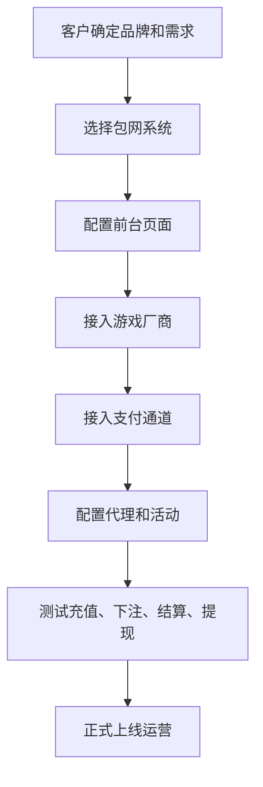

# 什么是包网？

## 一句话解释

包网就是使用已经成熟的博彩平台系统，快速搭建一个属于自己品牌的网站或平台。

## 适合谁看

- 想了解博彩平台如何搭建的人
- 正在评估包网和自建平台区别的团队
- 刚进入行业的产品、运营、设计和技术人员
- 需要向客户解释平台结构的人

## 核心结论

- 包网的核心价值是快速启动。
- 包网不是只买一个网站页面，而是使用一整套平台系统。
- 包网通常包含前台、后台、会员、代理、钱包、游戏、支付、报表等模块。
- 包网适合前期验证业务，但长期要关注稳定性、数据、风控和定制能力。
- 选择包网时，不能只看价格，还要看系统能力和服务能力。

## 通俗理解

可以把包网理解成“租用一套已经装修好的商业店铺”。

你不需要从零盖楼、装修、水电施工和安装系统，而是直接使用现成的空间，换上自己的品牌、域名、页面和运营配置，就可以开始营业。

但这也意味着，你需要关注这套系统是否稳定、是否能扩展、是否支持你想要的运营玩法，以及数据和权限是否足够清楚。

## 包网通常包含什么？

一个完整的包网平台通常包含：

- 品牌前台
- 会员系统
- 代理系统
- 钱包系统
- 游戏厂商接入
- 支付通道接入
- 活动系统
- 注单系统
- 报表系统
- 风控系统
- 后台权限系统
- 运维和客服支持

## 包网业务流程

## 包网和自建平台的区别

| 对比项 | 包网 | 自建平台 |
|---|---|---|
| 启动速度 | 快 | 慢 |
| 初期成本 | 相对低 | 高 |
| 定制能力 | 受系统限制 | 自由度高 |
| 技术团队要求 | 较低 | 较高 |
| 系统控制权 | 依赖服务方 | 自主控制 |
| 适合阶段 | 前期启动、快速验证 | 长期深度运营 |

## 常见误区

### 误区一：包网就是买一个网站

不是。前台页面只是用户看到的部分，真正复杂的是后台系统、钱包、游戏、支付、注单、风控和报表。

### 误区二：包网越便宜越好

便宜不一定是优势。如果系统不稳定、接口不完整、售后响应慢，后期运营成本会更高。

### 误区三：上线后就能自动赚钱

包网只是提供系统基础，真正决定效果的是运营、渠道、活动、支付体验、风控能力和用户服务。

## 风险与注意事项

- 系统稳定性是否足够
- 游戏厂商是否完整
- 支付通道是否稳定
- 后台权限是否清晰
- 数据归属是否明确
- 活动和代理配置是否灵活
- 风控规则是否可用
- 售后响应是否及时

## 常见问题

### 包网适合什么团队？

适合想快速验证业务、缺少完整技术团队、希望先使用成熟系统启动的团队。

### 包网是不是长期最优方案？

不一定。包网适合快速启动，但如果业务规模变大，可能需要考虑更强的定制能力、数据能力和系统控制权。

### 选择包网最重要看什么？

不要只看价格，要看系统稳定性、游戏和支付接入能力、后台灵活度、售后响应、数据权限和风控能力。

## 相关术语

- 包网
- 代理
- 中心钱包
- 免转钱包
- 游戏厂商
- 支付通道
- 风控
- 后台权限
