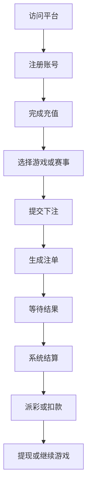
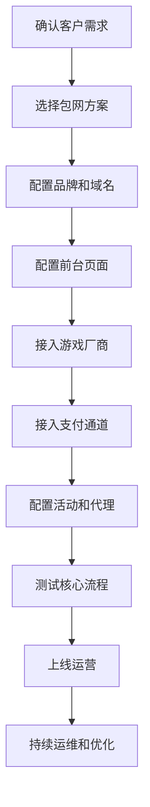
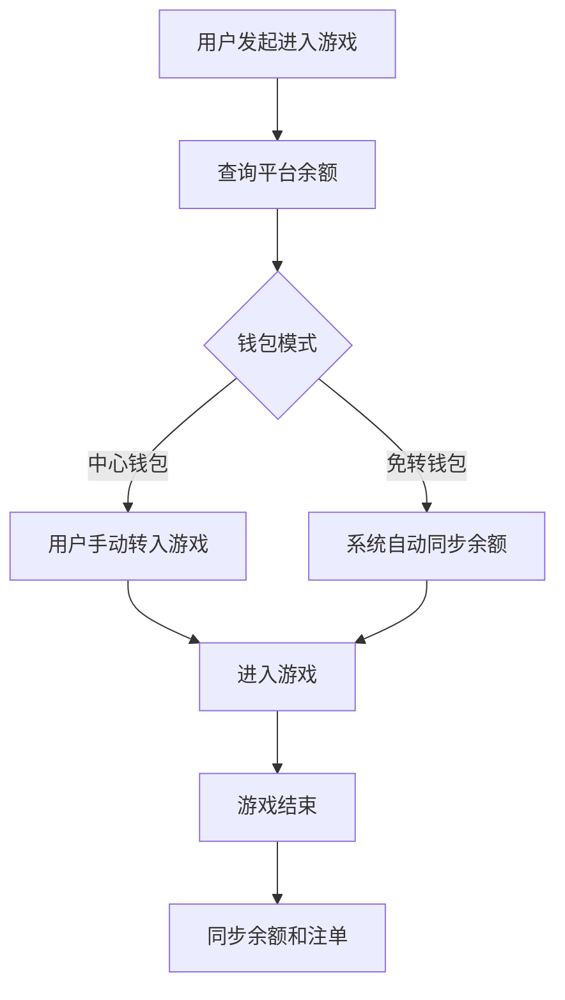
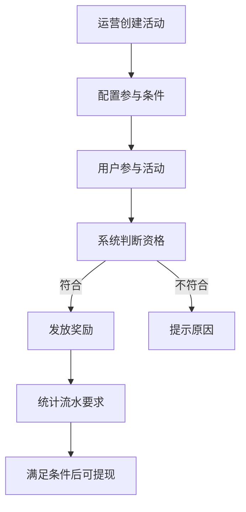
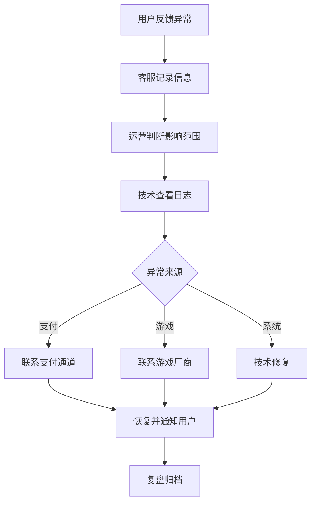
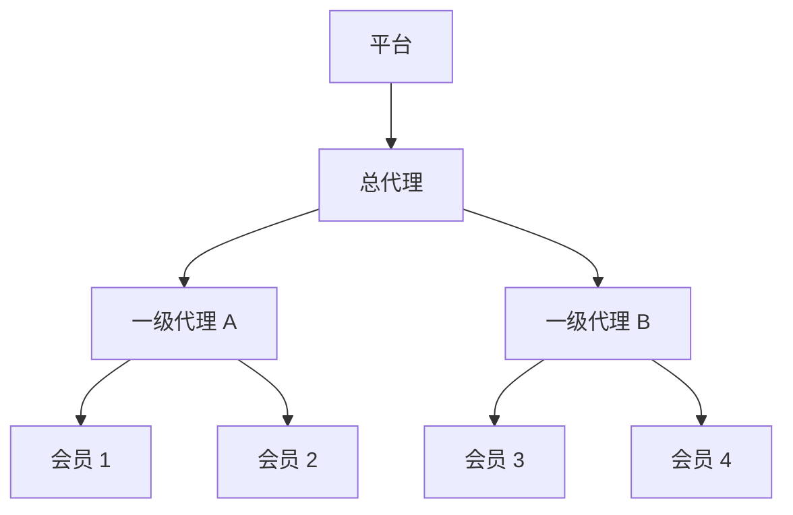

# Mermaid 图库

## 用户完整路径

```mermaid
flowchart TD
  A[访问平台] --> B[注册账号]
  B --> C[完成充值]
  C --> D[选择游戏或赛事]
  D --> E[提交下注]
  E --> F[生成注单]
  F --> G[等待结果]
  G --> H[系统结算]
  H --> I[派彩或扣款]
  I --> J[提现或继续游戏]
```

## 包网交付流程

```mermaid
flowchart TD
  A[确认客户需求] --> B[选择包网方案]
  B --> C[配置品牌和域名]
  C --> D[配置前台页面]
  D --> E[接入游戏厂商]
  E --> F[接入支付通道]
  F --> G[配置活动和代理]
  G --> H[测试核心流程]
  H --> I[上线运营]
  I --> J[持续运维和优化]
```

## 钱包转账流程

```mermaid
flowchart TD
  A[用户发起进入游戏] --> B[查询平台余额]
  B --> C{钱包模式}
  C -->|中心钱包| D[用户手动转入游戏]
  C -->|免转钱包| E[系统自动同步余额]
  D --> F[进入游戏]
  E --> F[进入游戏]
  F --> G[游戏结束]
  G --> H[同步余额和注单]
```

## 活动参与流程

```mermaid
flowchart TD
  A[运营创建活动] --> B[配置参与条件]
  B --> C[用户参与活动]
  C --> D[系统判断资格]
  D -->|符合| E[发放奖励]
  D -->|不符合| F[提示原因]
  E --> G[统计流水要求]
  G --> H[满足条件后可提现]
```

## 异常处理流程

```mermaid
flowchart TD
  A[用户反馈异常] --> B[客服记录信息]
  B --> C[运营判断影响范围]
  C --> D[技术查看日志]
  D --> E{异常来源}
  E -->|支付| F[联系支付通道]
  E -->|游戏| G[联系游戏厂商]
  E -->|系统| H[技术修复]
  F --> I[恢复并通知用户]
  G --> I
  H --> I
  I --> J[复盘归档]
```

## 代理推广关系

```mermaid
flowchart TD
  A[平台] --> B[总代理]
  B --> C[一级代理 A]
  B --> D[一级代理 B]
  C --> E[会员 1]
  C --> F[会员 2]
  D --> G[会员 3]
  D --> H[会员 4]
```
